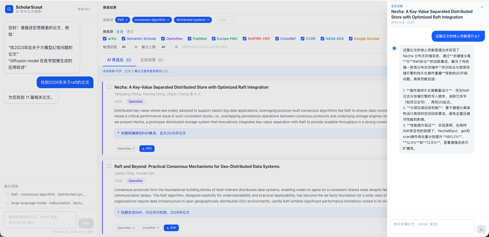
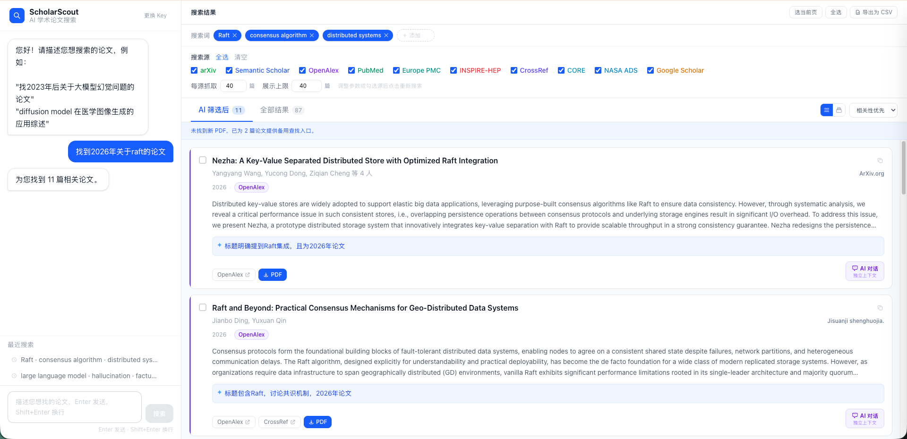

# ScholarScout

> 用自然语言找论文，不需要懂技术。

[](https://www.python.org)
[](https://github.com/astral-sh/uv)
[](https://react.dev)
[](https://fastapi.tiangolo.com)
[](https://github.com/Dshuishui/ScholarScout/actions/workflows/ci.yml)
[](LICENSE)
[](https://claude.ai)

ScholarScout 是一个面向非计算机专业研究者的学术论文搜索工具。你只需要用中文描述自己的需求，它会自动理解、搜索、过滤，把真实存在的相关论文列表返回给你，并支持一键预览和下载 PDF。

**在线体验**：[http://118.25.192.117](http://118.25.192.117)（需要自备 DeepSeek API Key）

---

## 界面预览

### AI 独立对话（核心特性）
> 每篇论文右下角「AI 对话」按钮，独立上下文，不影响主对话



### 搜索结果


---

## 功能

### 搜索与发现
- **自然语言搜索**：直接说"找 2023 年后关于大模型幻觉问题的论文"，不需要手动拼关键词
- **关键词可视化确认**：AI 提取关键词后先展示给用户，可增删后再开始搜索；结果页持续显示关键词，随时调整并重新搜索
- **搜索历史**：自动记录最近 10 条搜索，一键复用，跳过 AI 解析直接重搜
- **搜索源多选**：界面顶部可自由勾选 10 个数据源，全选或只搜特定领域的库
- **10 源并发搜索**：同时检索 arXiv、Semantic Scholar、OpenAlex、PubMed、Europe PMC、INSPIRE-HEP、CORE、NASA ADS、CrossRef、Google Scholar
- **智能去重合并**：DOI 精确匹配 + 标题规范化双重判断，重复论文合并最优字段（PDF、摘要、引用数）
- **多来源链接**：同一论文被多个源命中时，卡片展示所有来源按钮

### 结果展示
- **AI 相关性过滤**：搜索结果经大模型二次验证；Tab 切换"AI 筛选后 / 全部结果"，被过滤论文可查看
- **列表 / 分组视图切换**：按来源分组展示，快速定位特定数据库的结果
- **期刊 / 会议标注**：从各数据源提取发表 venue，显示在作者行右侧，便于快速判断论文质量
- **排序**：相关性优先 / 引用数最高 / 最新发表 / 最早发表
- **灵活参数配置**：界面直接调整每源抓取数量（最多 200）和展示上限（最多 500），修改后一键重新搜索

### PDF 与下载
- **PDF 深度查找**：搜索后自动为无 PDF 论文联网查找开放获取版本；找不到则展示 Sci-Hub、ResearchGate、CORE 等 8 个平台的跳转链接
- **批量下载**：勾选论文后一键打包下载 PDF（ZIP），失败明细自动写入压缩包
- **导出为 CSV**：全部结果一键导出，包含标题、作者、摘要、链接

### AI 对话
- **论文独立对话**：每张论文卡片右下角的「AI 对话」按钮，打开右侧抽屉与 AI 深入讨论该论文（方法、贡献、局限性等）；每篇论文保留独立上下文，不影响主对话
- **可配置快捷提问**：对话抽屉中的快捷提问可自由增删编辑，保存在本地
- **主对话**：不想搜论文时也可以直接在左侧对话框问 AI

### 账号与收藏（新）
- **可选注册**：邮箱注册/登录，不登录也可正常使用全部搜索功能
- **收藏夹**：登录后点击论文卡片上的书签图标收藏论文，随时在收藏夹页面查看和取消收藏
- **阅读历史**：每次打开论文 AI 对话时自动记录，历史页面展示最近 100 篇

---

## 工作原理


---

## 使用方法

ScholarScout 需要你提供自己的 **DeepSeek API Key** 来驱动 AI 功能（Key 只保存在本地浏览器，不会上传服务器）。

**第一步：获取 DeepSeek API Key**

1. 访问 [platform.deepseek.com](https://platform.deepseek.com) 注册账号
2. 在控制台创建一个 API Key，格式为 `sk-xxxxxxxx`
3. DeepSeek 价格很低，日常搜索几乎可以忽略不计

**第二步：开始使用**

访问 [118.25.192.117](http://118.25.192.117)，粘贴你的 API Key，然后用中文描述你想找的论文即可。

> **注意**：演示站部署在我个人的云服务器上，预计开放至 **2027 年初**。纯粹是闲来无事搭着玩，服务稳定性不做任何承诺，建议重要场景自行部署。

**示例搜索**

```
找2023年后关于 RAG 检索增强生成的综述论文
diffusion model 在医学图像分割方面的应用，最近两年的
帮我找强化学习用于机器人控制的论文，要求是顶会发表的
```

> **时间范围说明**：未指定时间时，默认搜索**近 5 年**的论文。如需搜索更早的文献，请在描述中明确说明，例如"找 2015 年以后的……"或"不限时间，找……"。

---

## 本地运行（个人电脑）

如果你不想依赖演示站，想在自己的电脑上本地运行，按以下步骤操作。整个过程不需要服务器，不需要 Nginx，在自己浏览器里打开即可使用。

**环境要求**：Python 3.11+、[uv](https://github.com/astral-sh/uv)、Node.js 18+、npm

**第一步：安装 uv（Python 包管理器）**

```bash
# macOS / Linux
curl -LsSf https://astral.sh/uv/install.sh | sh

# Windows（PowerShell）
powershell -ExecutionPolicy ByPass -c "irm https://astral.sh/uv/install.ps1 | iex"
```

**第二步：克隆仓库**

```bash
git clone https://github.com/Dshuishui/ScholarScout.git
cd ScholarScout
```

**第三步：启动后端**（新开一个终端窗口）

```bash
cd backend
uv sync          # 自动创建虚拟环境并安装依赖（首次运行需要一点时间）
uv run uvicorn main:app --reload --port 8000
```

看到 `Uvicorn running on http://127.0.0.1:8000` 说明后端启动成功。

**第四步：启动前端**（再开一个终端窗口）

```bash
cd frontend
npm install      # 安装前端依赖（首次运行需要一点时间）
npm run dev
```

看到 `Local: http://localhost:5173` 说明前端启动成功。

**第五步：打开浏览器**

访问 [http://localhost:5173](http://localhost:5173)，输入你的 DeepSeek API Key 即可开始使用。

---

## 可选数据源配置（API Key）

ScholarScout 默认已启用 7 个无需注册的数据源。以下数据源需要免费注册 API Key 才能启用：

| 数据源 | 覆盖领域 | Key 获取 |
|--------|---------|---------|
| **CORE** | 1.7 亿+ 开放获取论文 | [core.ac.uk/services/api](https://core.ac.uk/services/api) |
| **NASA ADS** | 天文 / 天体物理 / 地球科学 | [ui.adsabs.harvard.edu/user/settings/token](https://ui.adsabs.harvard.edu/user/settings/token) |
| **Semantic Scholar** | 综合，语义搜索 | [semanticscholar.org/product/api](https://www.semanticscholar.org/product/api) |

均完全免费。**没有 Key 的数据源会自动跳过，不影响其他数据源正常使用。**

### 本地运行时配置

```bash
cd backend
cp .env.example .env
# 用编辑器打开 .env，填入你拥有的 Key
```

### 服务器部署时配置

```bash
sudo mkdir -p /etc/scholarscout
sudo nano /etc/scholarscout/env
# 填入 Key 后保存
sudo systemctl restart scholarscout-backend
```

---

## 服务器部署

```bash
git clone https://github.com/Dshuishui/ScholarScout.git
cd ScholarScout
bash deploy/setup.sh   # 首次部署
```

后续更新：

```bash
bash deploy/deploy.sh
```

**环境要求**：Ubuntu 22.04+，4 核 4 GB 内存以上，需要可访问境外网络。

---

## 技术栈

| 层级 | 技术 |
|------|------|
| 前端 | React 18 + TypeScript + Vite + Tailwind CSS |
| 后端 | Python 3.11 + FastAPI + SSE 流式推送 + SQLite（用户数据） |
| 包管理 | [uv](https://github.com/astral-sh/uv)（后端）/ npm（前端） |
| AI | DeepSeek API（意图识别、关键词解析、相关性验证） |
| 搜索源 | 10 个学术数据库 + Unpaywall PDF 补全 |
| 部署 | Nginx + systemd，GitHub Actions CI |

---

## 搜索层说明

| 数据源 | 擅长领域 | 需要 Key |
|--------|---------|---------|
| **arXiv** | CS / 物理 / 数学 / 经济，覆盖最新预印本 | 否 |
| **Semantic Scholar** | 综合，语义搜索能力强 | 否（有 Key 可提升限速） |
| **OpenAlex** | 综合，2 亿+ 论文，开放获取友好 | 否 |
| **PubMed** | 医学 / 生物 / 生命科学 | 否 |
| **Europe PMC** | 生命科学 / 生化 / 医学，含 bioRxiv / medRxiv | 否 |
| **INSPIRE-HEP** | 高能物理 / 粒子物理 / 理论物理（CERN 运营） | 否 |
| **CrossRef** | 综合，1.5 亿+ 文献元数据，覆盖人文 / 工程 | 否 |
| **CORE** | 1.7 亿+ 开放获取全文 | 是（免费） |
| **NASA ADS** | 天文 / 天体物理 / 地球科学 | 是（免费） |
| **Google Scholar** | 综合，覆盖面最广 | 是（免费额度） |

搜索后通过 **Unpaywall** 自动为有 DOI 的论文补全合法开放获取 PDF（无需 Key）。

> **中文论文说明**：目前接入的数据源以英文学术库为主，对中文论文的支持有限。知网（CNKI）、万方、维普等主要中文数据库的 API 需要机构授权，暂未接入。如需查找中文文献，建议直接前往知网等平台检索。

---

## 项目状态

🚧 **项目正在持续改进中**，目前处于早期阶段。

**已完成**：账号系统（邮箱注册/登录）、论文收藏夹、阅读历史记录。

**近期计划**：跨论文 AI 对比分析、文献综述自动生成、更多模型支持（Claude、GPT 等）。

本项目的代码主要由 **AI（Claude）辅助生成**，作者利用业余时间玩着做的，并非严肃的生产级项目。如果你在使用过程中遇到 bug 或有改进想法，非常欢迎通过 [GitHub Issues](https://github.com/Dshuishui/ScholarScout/issues) 友好地告知——毕竟大家都是第一次，轻喷 🙏

---

## 致谢

- [DeepSeek](https://www.deepseek.com) — 提供 AI 推理能力
- [arXiv](https://arxiv.org)、[Semantic Scholar](https://www.semanticscholar.org)、[OpenAlex](https://openalex.org)、[PubMed](https://pubmed.ncbi.nlm.nih.gov)、[Europe PMC](https://europepmc.org)、[INSPIRE-HEP](https://inspirehep.net)、[CORE](https://core.ac.uk)、[NASA ADS](https://ui.adsabs.harvard.edu)、[CrossRef](https://www.crossref.org) — 提供免费开放的学术数据 API
- [Unpaywall](https://unpaywall.org) — 提供开放获取 PDF 链接查询服务
- [astral-sh/uv](https://github.com/astral-sh/uv) — 极速 Python 包管理工具

---

## License

MIT © [Dshuishui](https://github.com/Dshuishui)
