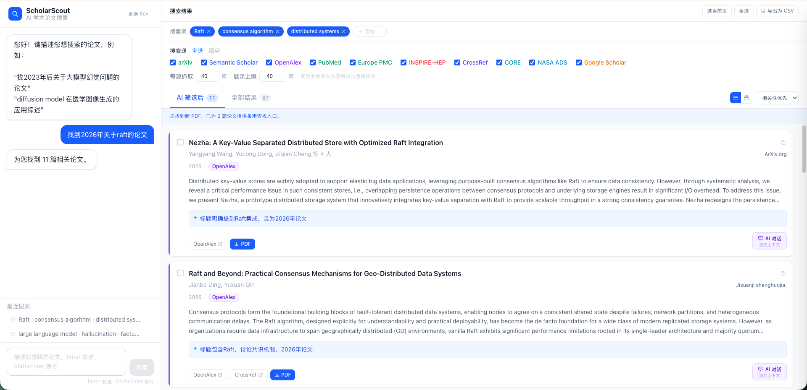
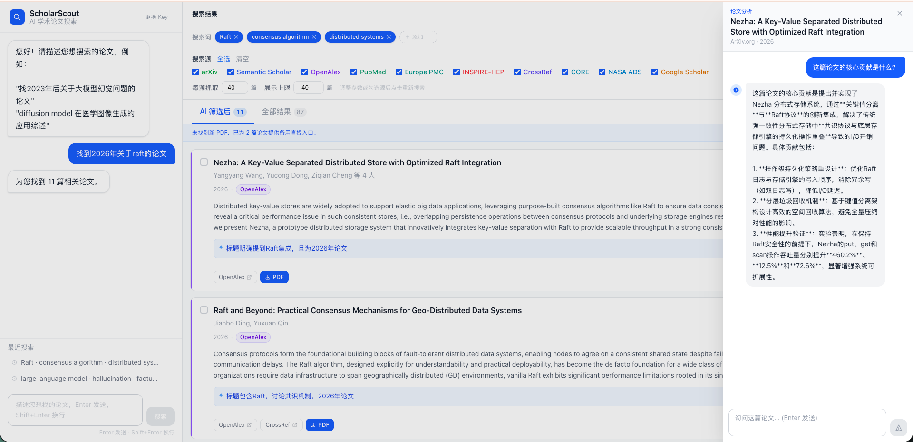

# ScholarScout

> 用自然语言找论文，AI 验证相关性，向量检索挖掘语义关联。

[English](README.md) | 中文

[](https://www.python.org)
[](https://react.dev)
[](https://fastapi.tiangolo.com)
[](https://github.com/Dshuishui/ScholarScout/actions/workflows/ci.yml)
[](LICENSE)
[](https://github.com/astral-sh/uv)

ScholarScout 是一个全栈学术论文搜索平台。前端用自然语言输入需求，后端用关键词加语义的混合检索并发查询最多 10 个学术数据库（其中 7 个无需任何 Key），经 LLM 二次验证后返回结果，并将论文摘要异步向量化入库，支持语义检索、多文献 RAG 问答和相似度关系图谱。

**在线体验**：[http://118.25.192.117](http://118.25.192.117)

> 注册并验证邮箱即可获得 **3 次免费搜索**，无需配置 API Key。也可填入自己的 DeepSeek API Key 无限使用。

---

## 界面预览

### 搜索结果


### AI 论文对话
> 每篇论文独立对话上下文，支持上传 PDF 全文分析



---

## 核心特性

### 搜索与发现
- **自然语言搜索**：输入"找 2023 年后关于大模型幻觉问题的论文"，AI 自动提取关键词、时间范围，无需手动拼 Boolean 查询
- **关键词可视化确认**：AI 提取结果先展示供用户确认，可增删后再搜索，结果页随时调整并重新搜索
- **10 源并发搜索**：arXiv、Semantic Scholar、OpenAlex、PubMed、Europe PMC、INSPIRE-HEP、CrossRef 无需 Key；CORE、NASA ADS、Google Scholar（经 SerpAPI）配置 Key 后启用
- **混合检索**：OpenAlex 关键词检索（提取出的同义词用布尔 OR 连接）与 OpenAlex 语义检索用 RRF 融合（配置 `OPENALEX_API_KEY` 后启用语义检索）
- **按领域选源**：大模型判断需求所属学科，纯计算机问题不查 PubMed / Europe PMC，非物理天文问题不查 INSPIRE-HEP / NASA ADS
- **引用量参与排序**：大模型相关性评分加上封顶的引用量加分，同分时奠基论文排在前面
- **不偷偷限定年份**：描述里提到时间才按时间过滤
- **智能去重合并**：DOI 精确匹配 + 标题规范化双重判断，重复论文合并最优字段（PDF、摘要、引用数）
- **AI 相关性验证**：搜索结果经 LLM 二次过滤，可切换"AI 筛选后 / 全部结果"对比查看

### PDF 获取
- **PDF 深度查找**：无 PDF 的论文自动通过 Kimi 联网查找开放获取版本
- **备用入口**：找不到时展示 Sci-Hub、ResearchGate、CORE 等 8 个平台的跳转链接
- **批量打包下载**：勾选论文后一键下载 ZIP，失败明细写入压缩包内日志

### AI 分析
- **多论文 AI 分析**：勾选 2 篇以上，支持三种全屏分析模式：
  - **对比分析**：汇总表格 + 方法路线、创新点、实验结果逐项对比
  - **文献综述**：正式学术风格，可直接用作 Related Work 草稿
  - **研究趋势**：时间线梳理技术演进，预测未来研究方向
- **论文独立对话**：每张卡片独立 AI 对话抽屉，上下文互不干扰
- **PDF 全文分析**：上传 PDF 后切换为全文模式，支持 DeepSeek V4 百万 token 上下文
- **PDF 云端持久化**：上传的全文保存服务端，换设备登录后自动恢复

### 语义检索与 RAG
- **向量语义检索**：搜索结果异步向量化入库（ChromaDB + ONNX MiniLM L6 v2，本地推理，无需 API Key）；后续可用自然语言在已有论文库里做语义相似搜索，跨越关键词限制
- **多文献 RAG 问答**：勾选 2 篇以上，进入 RAG 问答面板；问题和论文摘要一起送入 DeepSeek，流式返回带引用标注的回答
- **实时向量化通知**：索引完成后通过 WebSocket 推送"已索引 N 篇论文"提示

### 论文关系图谱
- **语义相似度图谱**：选中多篇论文，后端逐对计算 cosine 相似度，返回 `{nodes, links}`
- **力导向可视化**：`react-force-graph-2d` 渲染，节点大小 = log(引用数)，边粗细 = 相似度分值
- **可调阈值**：顶栏滑块实时调节相似度阈值，低于阈值的边自动隐去

### 订阅与每日推送
- **关键词订阅**：搜索完成后一键订阅，系统立即在后台建立推送队列
- **每日推送**：每天北京时间 08:00 从队列取出当天论文发送邮件，AI 过滤确保相关性
- **一键退订**：每封邮件都带免登录退订链接，并设置 `List-Unsubscribe` / `List-Unsubscribe-Post` 邮件头
- **队列自动补充**：剩余不足 5 篇时自动后台补搜；也可手动刷新
- **推送进度可查**：订阅管理页展示完整队列（✅ 已发 / 📅 待发 + 计划日期）

### 账号与权限
- **邮箱注册 + 验证**：JWT 认证，注册/登录接口限流防暴力
- **免费试用**：验证邮箱后原子扣减免费额度（`WHERE free_searches > 0` 防并发超额）
- **收藏夹 / 阅读历史 / 搜索会话**：登录后全端同步
- **账号自助**：修改密码（其他设备自动退出登录）、导出全部个人数据（JSON）、注销账号
- **隐私政策与服务条款**：注册时提示，账号菜单中随时查看

### 实时推送（WebSocket）
- 前端与后端保持持久 WebSocket 连接，支持可选 JWT 认证和 ping/pong 保活
- 向量索引完成、订阅队列就绪等后台事件实时推送 toast 通知
- 连接状态指示（绿/黄/灰小圆点），指数退避自动重连

### 可靠性与安全
- **数据源健康监控**：记录每次数据源调用；每小时检查一次，原本正常的源开始全部返回 0 篇、所有源都没结果、订阅停止推送时给站长发邮件（同一问题每天最多一封）；`/api/health` 可查看实时状态
- **检索回归测试**：`backend/eval/retrieval_benchmark.py` 检查计算机、生物医学、物理等领域的 16 篇经典论文能否进入候选池，不调用大模型
- **加固的 PDF 代理**：每次跳转都先做 DNS 解析级别的 SSRF 检查，50 MB 上限，限制并发下载数
- **防滥用**：按真实客户端 IP（nginx 设置的 `X-Real-IP`）限流，按用户限制试用额度的大模型调用和订阅任务
- **登录凭证可撤销**：JWT 中带 `users.token_version`，修改或重置密码时版本号加 1

---

## 技术栈

| 层级 | 技术 | 说明 |
|------|------|------|
| **前端** | React 19 + TypeScript + Vite + Tailwind CSS v4 | |
| **图谱可视化** | react-force-graph-2d | D3 力导向，Canvas 渲染 |
| **后端** | Python 3.11 + FastAPI | 异步优先 |
| **实时通信** | SSE（搜索进度流）+ WebSocket（后台事件推送） | 双通道 |
| **数据库** | SQLAlchemy async + Alembic 迁移 | SQLite（开发）/ PostgreSQL（生产）|
| **向量数据库** | ChromaDB + ONNX MiniLM L6 v2 | 本地推理，无需 API |
| **缓存** | Redis（可选）| 搜索结果缓存，TTL 1h，未配置时自动降级 |
| **AI** | DeepSeek API（OpenAI 兼容）| 意图识别、相关性验证、RAG 问答 |
| **日志** | structlog | JSON / 彩色控制台双模式 |
| **错误追踪** | Sentry SDK | FastAPI + SQLAlchemy 集成，未配置时无副作用 |
| **测试** | pytest + httpx AsyncClient | 异步集成测试，rate-limit fixture 隔离 |
| **CI/CD** | GitHub Actions | lint → test → build，uv 缓存加速 |
| **包管理** | uv（后端）/ npm（前端）| |

---

## 技术亮点

> 记录几个非平凡的工程决策，供技术背景的读者参考。

1. **向量化不阻塞 SSE 流**：搜索完成后用 `asyncio.create_task` + 独立 `ThreadPoolExecutor` 异步触发 ChromaDB 写入，主 SSE 响应不等待。

2. **现有数据库无损接入 Alembic**：`init_db()` 检测是否存在 `alembic_version` 表，首次启动旧库时自动 `stamp head` 而非直接 `upgrade`，避免误判为空库执行 DDL。

3. **WebSocket 推送按 client_key 分组**：`ConnectionManager` 以 `user:{id}` 或 `anon:{cid}` 为 key 管理连接 set，同一用户多标签页同时在线均可收到通知，且死连接在下一次发送时惰性清理。

4. **Redis 缓存零侵入降级**：`cache_service.py` 在模块级懒初始化，`REDIS_URL` 为空时 `_get_redis()` 返回 `None`，所有 `get/set` 调用提前 return，业务代码无需 try/except 包裹。

5. **PostgreSQL 连接池按方言启用**：`create_async_engine` 的 `pool_size / max_overflow / pool_pre_ping` 只在非 SQLite 时传入，避免 SQLite 模式下触发 `ProgrammingError`。

6. **Alembic `render_as_batch` 按方言动态开关**：SQLite 不支持原生 `ALTER COLUMN`，需 batch mode；PostgreSQL 原生支持。`env.py` 通过 `"sqlite" in url` 判断，两套数据库共用同一迁移文件。

7. **免费额度原子扣减**：`UPDATE users SET free_searches = free_searches - 1 WHERE id = ? AND free_searches > 0`，行级锁保证并发安全，`rowcount == 0` 时快速失败，无需应用层加锁。

8. **SSE 流中的并发源进度上报**：每个数据源完成后通过 `asyncio.Queue` 把 `{source, count}` 塞进队列，主 generator 在等搜索 task 期间非阻塞轮询队列并 yield `source_done` 事件，前端进度条实时更新。

9. **structlog 双模式渲染**：`LOG_FORMAT=console`（开发，彩色 key=value）/ `json`（生产，JSON 行适合 Loki/Datadog），同一 `get_logger()` 调用，运行时按环境切换，不改代码。

10. **前端 WS 指数退避重连**：`useWebSocket` hook 在 `onclose` 时 `setTimeout(connect, delay)`，每次失败后 `delay = min(delay * 2, 30000)`，连接恢复后重置为 1s；ping/pong 25s 一次保活，防止 Nginx 60s 空闲超时断开。

11. **按搜索引擎适配查询语法**：OpenAlex、PubMed、Europe PMC、NASA ADS、INSPIRE 会把空格分隔的词当成 AND，大模型给出的同义词在这些源里用 OR 连接；CrossRef 按词袋打分、不认 OR，保持拼成一句。用回归测试验证：召回从 10/16 提升到 15/16。

12. **RRF 的 k 取 10 而不是 60**：k=60 时"两路都排第 50"（2/110）会压过"只在一路排第 1"（1/61），截断融合结果时恰好丢掉混合检索想补上的语义独有结果。

13. **不让 Alembic 接管日志**：应用内运行迁移时 `alembic/env.py` 跳过 `fileConfig()`，否则它会把根日志级别改成 WARNING 并禁用所有已有 logger，线上的业务警告会被静默吞掉。

14. **不建会话表也能撤销 JWT**：凭证里带 `ver`，校验时与 `users.token_version` 比较；没有 `ver` 的旧凭证视为版本 0，上线撤销功能时不会踢掉任何人。

---

## 快速开始

### 在线体验

访问 [118.25.192.117](http://118.25.192.117)，注册并验证邮箱即可免费体验 3 次搜索。

**示例搜索**

```
找2023年后关于 RAG 检索增强生成的综述论文
diffusion model 在医学图像分割方面的应用，最近两年的
帮我找强化学习用于机器人控制的论文，要求是顶会发表的
```

> 描述里没提时间就不限年份；提到"2023 年后""近两年"等才按时间过滤。

---

## 本地开发

**环境要求**：Python 3.11+、[uv](https://github.com/astral-sh/uv)、Node.js 18+

```bash
# 克隆仓库
git clone https://github.com/Dshuishui/ScholarScout.git
cd ScholarScout

# 后端
cd backend
uv sync
uv run uvicorn main:app --reload --port 8000

# 前端（另开终端）
cd frontend
npm install
npm run dev
```

访问 [http://localhost:5173](http://localhost:5173)，输入 DeepSeek API Key 即可使用。

---

## 环境变量参考

复制 `backend/.env.example` 为 `backend/.env` 并按需填写。未填写的变量均有合理默认值，不影响启动。

| 变量 | 默认值 | 说明 |
|------|--------|------|
| `DATABASE_URL` | `sqlite+aiosqlite:///./scholarscout.db` | 生产环境替换为 `postgresql+asyncpg://...` |
| `REDIS_URL` | _(空，禁用缓存)_ | `redis://localhost:6379/0` |
| `CACHE_SEARCH_TTL` | `3600` | 搜索结果缓存时间（秒） |
| `SENTRY_DSN` | _(空，禁用)_ | Sentry 项目 DSN |
| `SENTRY_ENVIRONMENT` | `development` | `production` / `staging` |
| `SENTRY_TRACES_SAMPLE_RATE` | `0.1` | 性能追踪采样率 |
| `LOG_FORMAT` | `console` | `json` 输出结构化日志 |
| `LOG_LEVEL` | `INFO` | `DEBUG` / `WARNING` |
| `CORE_API_KEY` | _(空)_ | [core.ac.uk](https://core.ac.uk/services/api) 免费申请 |
| `NASA_ADS_API_KEY` | _(空)_ | [ads.harvard.edu](https://ui.adsabs.harvard.edu/user/settings/token) 免费申请 |
| `OPENALEX_API_KEY` | _(空)_ | **强烈建议配置**。在 [openalex.org/settings/api](https://openalex.org/settings/api) 免费获取；不配置时每天额度约 0.1 美元。配置后同时启用语义检索 |
| `SEMANTIC_SCHOLAR_API_KEY` | _(空)_ | **强烈建议配置**。[免费申请](https://www.semanticscholar.org/product/api#api-key-form)；无 Key 时共用限流池，基本一直 429 |
| `SERPAPI_KEY` | _(空)_ | 通过 [SerpAPI](https://serpapi.com) 搜索 Google Scholar（免费 250 次/月） |
| `JWT_SECRET` | `dev-only-secret-change-me-in-production` | **生产必须替换** |
| `DEEPSEEK_SYSTEM_KEY` | _(空)_ | 免费搜索（未登录体验和新注册账号）使用的系统 Key |
| `ANON_TRIAL_SEARCHES` | `2` | 未登录访客每个浏览器可免费搜索的次数 |
| `ANON_TRIAL_PER_IP_DAY` | `20` | 同一 IP 24 小时内未登录免费搜索上限 |
| `ANON_TRIAL_DAILY_CAP` | `200` | 全站 24 小时内未登录免费搜索上限（费用封顶，用到 80% 发告警邮件） |
| `FREE_SEARCHES_QUOTA` | `3` | 验证邮箱后赠送的免费搜索次数 |
| `DEEPSEEK_API_KEY` | _(空)_ | 订阅推送 AI 筛选用的服务端 Key |
| `SMTP_HOST / SMTP_USER / SMTP_PASS` | _(空)_ | 邮件推送配置（QQ 邮箱授权码） |
| `ADMIN_EMAIL` | _(维护者邮箱)_ | 接收新留言通知和运维告警 |
| `APP_BASE_URL` | `http://118.25.192.117` | 邮件链接中的网站地址，也是默认允许的跨域来源 |
| `CORS_ORIGINS` | `APP_BASE_URL` | 额外允许跨域调用 API 的来源，逗号分隔 |

---

## 数据源说明

| 数据源 | 擅长领域 | 需要 Key |
|--------|---------|---------|
| **arXiv** | CS / 物理 / 数学 / 经济，最新预印本 | 否 |
| **Semantic Scholar** | 综合，语义搜索能力强 | 否，但强烈建议申请免费 Key（无 Key 时基本被限流） |
| **OpenAlex** | 综合，2 亿+ 论文，开放获取友好，支持关键词和语义检索 | 否，但强烈建议申请免费 Key（无 Key 每天额度约 0.1 美元） |
| **PubMed** | 医学 / 生物 / 生命科学 | 否 |
| **Europe PMC** | 生命科学 / 医学，含 bioRxiv / medRxiv | 否 |
| **INSPIRE-HEP** | 高能物理 / 粒子物理（CERN 运营） | 否 |
| **CrossRef** | 综合，1.5 亿+ 文献元数据，覆盖人文 / 工程 | 否 |
| **CORE** | 1.7 亿+ 开放获取全文 | 是（免费） |
| **NASA ADS** | 天文 / 天体物理 / 地球科学 | 是（免费） |
| **Google Scholar** | 综合，覆盖面最广 | 是，需 SerpAPI Key（免费 250 次/月） |

搜索后通过 **Unpaywall** 自动为有 DOI 的论文补全合法开放获取 PDF（无需 Key）。

> **中文论文**：目前接入的数据源以英文学术库为主。知网、万方等主要中文库的 API 需机构授权，暂未接入。

---

## 服务器部署

```bash
git clone https://github.com/Dshuishui/ScholarScout.git
cd ScholarScout
bash deploy/setup.sh    # 首次部署

bash deploy/deploy.sh   # 后续更新
```

**环境要求**：Ubuntu 22.04+，4 核 4 GB 内存以上，可访问外网。`deploy/nginx.conf` 已包含 `/ws` WebSocket 转发和按接口设置的上传大小限制，每次运行 `deploy.sh` 都会自动安装。

---

## 项目状态

**已完成**

- 全栈搜索管线：自然语言 → 关键词提取 → 10 源并发 → LLM 验证 → SSE 流式返回
- 向量语义检索：ChromaDB + ONNX 本地嵌入，无需外部 API
- 多文献 RAG 问答：DeepSeek 流式，引用标注
- 论文相似度关系图谱：pairwise cosine + react-force-graph-2d
- WebSocket 实时推送通知（后台任务完成事件）
- PostgreSQL / Redis 生产就绪（环境变量驱动，SQLite 降级）
- Alembic 数据库迁移（`render_as_batch` 按方言动态开关）
- structlog 结构化日志 + Sentry 错误追踪（均可无副作用禁用）
- GitHub Actions CI（lint + test + build）
- 关键词订阅 + 每日邮件推送队列（APScheduler）
- 多论文 AI 分析（对比 / 综述 / 趋势，独立缓存）
- PDF 全文对话（云端持久化）
- 邮箱注册 / JWT 认证 / 免费额度原子扣减
- 移动端响应式
- 混合检索、按领域选源、引用量参与排序、检索回归测试
- 数据源健康监控与站长邮件告警
- 账号自助（修改密码、导出数据、注销账号）、隐私政策与服务条款

**近期计划**

- HTTPS 与数据库自动备份
- arXiv 本地元数据库（OAI-PMH 收割），绕开 API 限流，详见 `docs/backlog.md`
- 更多模型支持（Claude、GPT-4o）

---

## 致谢

- [DeepSeek](https://www.deepseek.com) — AI 推理能力
- [ChromaDB](https://www.trychroma.com) — 本地向量数据库
- [arXiv](https://arxiv.org)、[Semantic Scholar](https://www.semanticscholar.org)、[OpenAlex](https://openalex.org)、[PubMed](https://pubmed.ncbi.nlm.nih.gov)、[Europe PMC](https://europepmc.org)、[INSPIRE-HEP](https://inspirehep.net)、[CORE](https://core.ac.uk)、[NASA ADS](https://ui.adsabs.harvard.edu)、[CrossRef](https://www.crossref.org) — 免费开放学术数据 API
- [Unpaywall](https://unpaywall.org) — 开放获取 PDF 查询
- [astral-sh/uv](https://github.com/astral-sh/uv) — 极速 Python 包管理

---

## License

MIT © [Dshuishui](https://github.com/Dshuishui)
